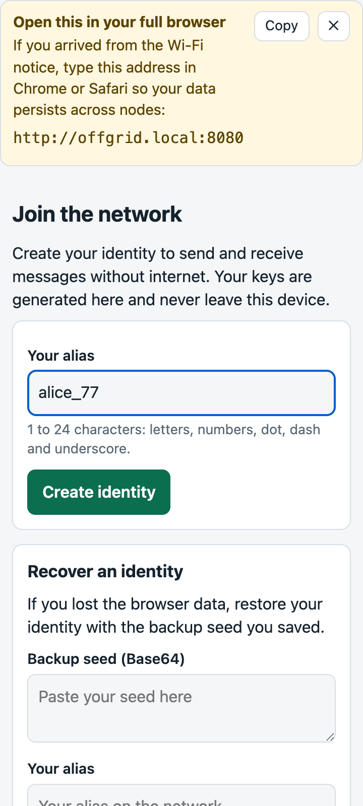
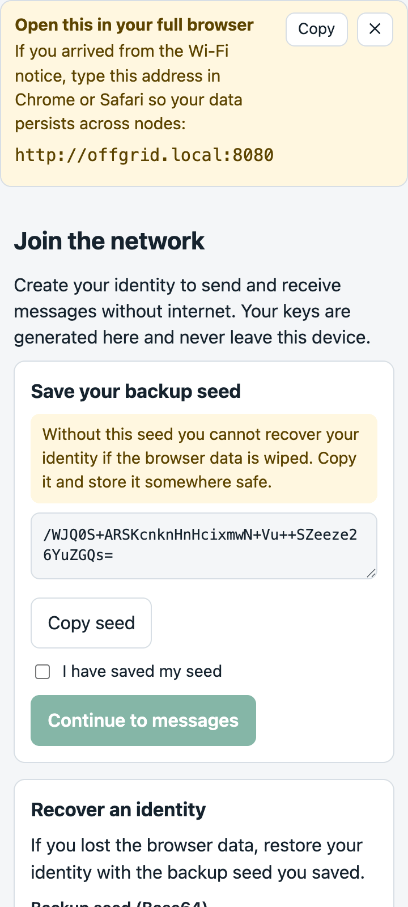
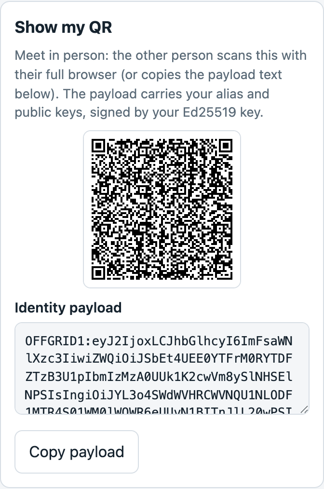
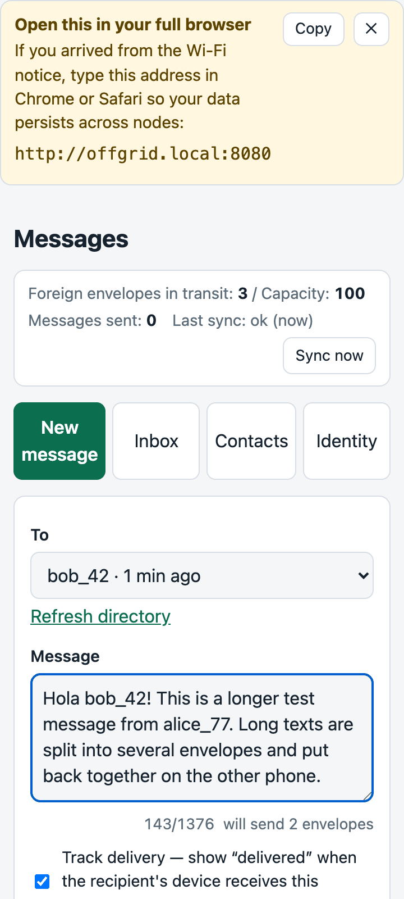
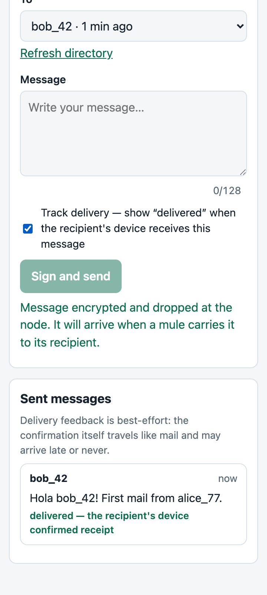
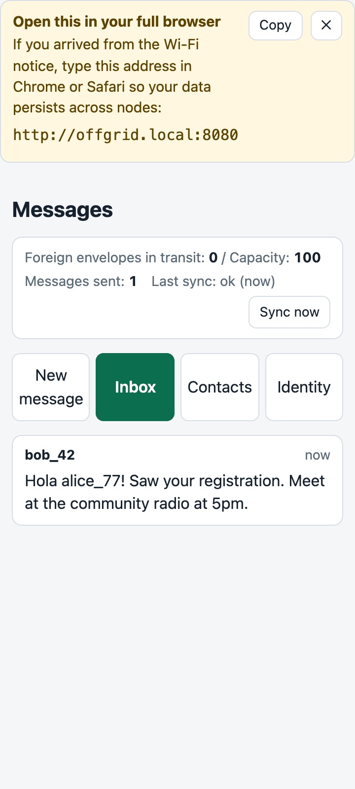
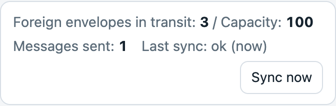

# Off-Grid Messages — Quick-Start Guide (for end users)

| | |
|---|---|
| **Audience** | People using the network, not computer experts. Hand this out on paper or show it on a phone. |
| **Source of truth** | This file is the translatable master text. The node serves the same guide (with screenshots) at `http://offgrid.local:8080/guide`; its printable layout lives in `node/web/guide.html` + `node/web/css/guide.css` and its screenshots in `node/web/img/guide/`. |
| **Translation note** | The installer's default region is Spanish-speaking; the app itself is English-only today. Keep every numbered step at most two short sentences. Do not use idioms. Words in “quotes” are the exact English words shown by the app — keep them in English and translate the explanation around them. |

## What is this?

You can send messages with **no internet and no phone signal**. Messages travel
inside the phones of people who walk past. Nobody can read them — not the Wi-Fi
box (“node”), not the people carrying them. Only the recipient's phone can open them.

## Steps

1. **Join the Wi-Fi.** Open the Wi-Fi settings and join the network `offgrid-messages`. It has no password.

2. **Open your full browser.** The Wi-Fi may open a page by itself — that small window forgets everything. Instead, open **Chrome** (Android) or **Safari** (iPhone) yourself and type this address: `http://offgrid.local:8080`

   

3. **Keep the icon (do once).** Ask the browser to put an **Offgrid** icon on your home screen: Android — browser menu (⋮) → “Add to Home screen”; iPhone — Share button → “Add to Home Screen”. The icon is a shortcut that opens the page when you are on the node's Wi-Fi.

4. **Register once.** Type a name under “Your alias” and tap “Create identity”. Your secret keys are made on your phone and never leave it.

5. **Save your seed — the most important step.** The app shows a long code under “Save your backup seed”: write it on paper, keep it safe, then tick “I have saved my seed” and tap “Continue to messages”. If the phone loses the app's data, only this seed brings your identity back.

   

6. **Add a person to write to.** Easiest is to meet in person: both open the “Contacts” tab, you tap “Show my QR”, and the other person scans it (or pastes the payload text and taps “Add contact from pasted payload”). Or simply pick a name from the list when writing — the “New message” tab shows everyone registered at this node.

   

7. **Write a message.** In the “New message” tab, pick the person under “To”, write your text, and tap “Sign and send”. One envelope carries a short text; a longer message costs several envelopes — the app shows the count (“will send 2 envelopes”) before you send, and 16 envelopes are the most a message can cost.

   

8. **Watch the delivery states.** Under “Sent messages” your message starts as “queued — waiting for the next sync”, becomes “sent — carried by a mule”, and shows “delivered — the recipient's device confirmed receipt” when their phone got it. This feedback is best-effort: no “delivered” does not always mean lost.

   

9. **Check your inbox.** Tap “Inbox”, or “Sync now” at the top to fetch mail again. If a long message shows “Partial message — still traveling”, wait: the rest of it is still walking.

   

10. **Be a mule.** The top of the page shows “Foreign envelopes in transit”: other people's encrypted messages riding in your phone — **that is the system working, not a bug**. Walk to the next node's Wi-Fi and sync: your phone drops their mail and picks up yours.

    

## What to expect (read this once)

- **Messages ride with people.** Your message arrives only when someone walks from a node near you to a node near the recipient. Minutes in a small village, days across regions.
- **Longer messages cost more.** Every envelope is space in someone's pocket. A mule carries at most 100 envelopes — a very long message eats a visible share of that.
- **Mail expires after 7 days.** If no mule reaches the recipient's node in 7 days, the message is gone. Important news? Also tell it in person.
- **Privacy ends at the recipient's device.** Nodes, mules and the Wi-Fi air see only scrambled bytes. Once the message is on the recipient's phone, it is readable there — protect the phone like the letter.

## Troubleshooting

1. **The portal does not open.** Open Chrome or Safari yourself and type `http://offgrid.local:8080`. Do not stay inside the small window the Wi-Fi opened.
2. **You opened the page by the numbers** (an address like `10.42.0.1:8080`). The node sends you to `offgrid.local:8080` automatically. Always use the name — your account lives under the name, not under the numbers.
3. **You lost your seed.** If the app still works: open the “Identity” tab, tap “Show seed” and write it down now. If the app's data is already gone and you have no seed: the identity is lost; register again with a new alias and tell your contacts.
4. **“Foreign envelopes in transit” says 100.** Your pocket is full. Walk to any node's Wi-Fi and tap “Sync now” to drop the cargo. Until then, new mail may not fit (the oldest envelope in your pocket is dropped first).
5. **Nothing arrives.** Check that the sender shows more than “queued”, wait for a mule to walk, and remember the 7-day limit. Silence means “not yet known”, not always “lost”.

## Ten words you need

- **Node** — the Wi-Fi box that keeps encrypted messages like a mailbox.
- **Portal** — the page the node shows you over its Wi-Fi.
- **Full browser** — Chrome or Safari, opened by you. Not the small window the Wi-Fi opens by itself.
- **Alias** — the name you pick, like `alice_77`. It is only a label.
- **Seed** — a long code that IS your identity. If you lose it, you lose your account forever.
- **Envelope** — one small encrypted package. A message may need one or more envelopes.
- **Mule** — a person whose phone carries other people's envelopes to the next node.
- **Directory** — the list of people registered on the node you are at.
- **Contact** — a person you added in person, saved on your phone only.
- **Sync** — the moment your phone swaps mail with a node: it drops what it carries and picks up what is yours.

---

*Master text: `docs/quick-start.md` (issue #23). Translations must be paired
with this file and keep the step structure identical. Validation with real
first-time users happens in the issue #20 field test.*
